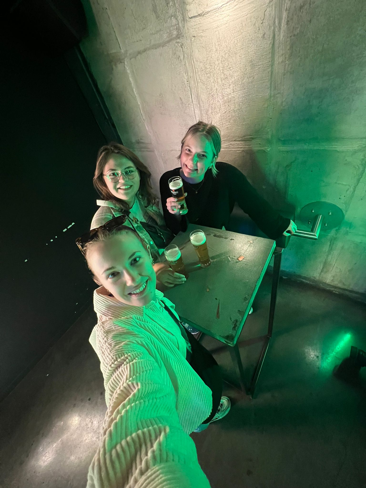

# yeast

Reflexion

Kurze Beschreibung des Projekts:
Mit unserer API können wir Luftqualitätsdaten aus jedem Land der Welt abrufen.
Wir haben uns für 5 Städte in Südasien entschieden. Diese Städte sind Hanoi (Vietnam), Mae Hong Son (Thailand), Kunjaban (Indien), Guangzhou (China) und Dhopagachi (Indien). In unserer Datenbank führen wir jedoch nur den Wert 2.5PM (Feinstaub) und zeigen ihn auch so auf unserer Website an.

Auf unserer interaktiven Asien-Karte können Sie die Farben der Standortpins sehen. Die Farben zeigen an, ob der 2.5PM Wert zwischen 0-50 (gut, grün), 51-100 (mässig, gelb), 101-150 (ungesund, orange) und 151-200 (gefährlich, rot) liegt. Über den Schieberegler können die Daten der letzten zwei Wochen abgerufen werden.

Zusätzlich haben wir zwei Felder programmiert, welches die durchschnittlich beste und welches die durchschnittlich schlechteste Stadt der letzten zwei Wochen ist.

Erkenntnisse:
Unsere Learnings aus IM4 sind die Verwendung einer alternativen Grafiktechnik (svg) und die Integration von JavaScript. Diese beiden Punkte haben uns die meiste Zeit gekostet und uns auch die meisten Sorgen bereitet. Ausserdem wissen wir jetzt genau, woher unsere Daten kommen und was mit ihnen auf der Website und im Hintergrund passiert. 

Schwierigkeiten:
Die grösste Schwierigkeit war, dass wir nicht chart.js, sondern svg-Code für unsere Asien-Karte und ihre Ortspins brauchten. Die Schwierigkeit bestand also darin, dass wir nicht wussten, wie wir die svg-Datei einbetten sollten. Ausserdem hatten wir Schwierigkeiten, den JavaScript-Code richtig anzuwenden. 

Ressourcen verwenden:
Die am meisten genutzte Ressource neben den LBA's war CoPilot. In diesem Semester haben wir mehr mit CoPilot als mit ChatGPT gearbeitet. Das lag einfach daran, dass wir CoPilot mehr vertrauten und es alle unsere Dateien mit den Codes kannte.
Natürlich haben wir, wie bereits erwähnt, die LBA's oft und gerne in Anspruch genommen.

Team YEAST
Lynn Benz, lynn.benz@stud.fhgr.ch
Aline Albrecht, aline.albrecht@stud.fhgr.ch
Lisa Niggli, lisa.niggli@stud.fhgr.ch

